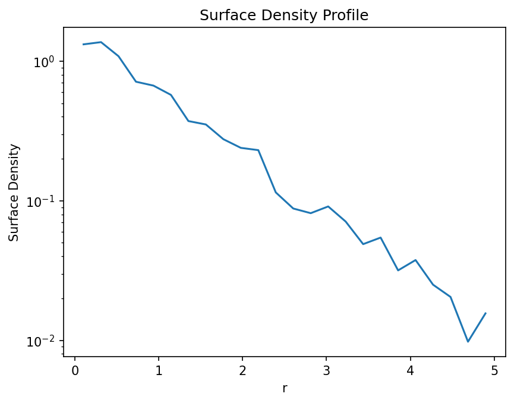
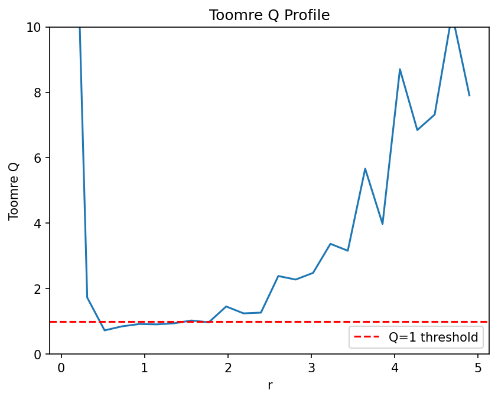
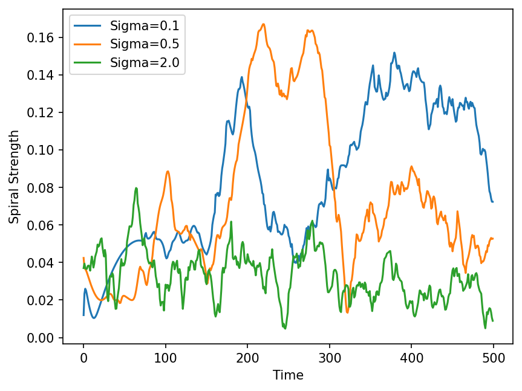

# Self Gravitating Galactic Disk Simulation with Toomre Instability

## Physics

This project is a direct extension of my previous reproduction of the Toomre & Toomre (1972) paper on galactic bridges and tails. In that model, disk stars are test particles that feel the gravity of the two galaxy centers but they don't pull on each other. This was done in the original paper because of computational limitations at the time.

Now when we add self gravity, that is disk stars pull on each other, dense regions can collapse under their own weight. Whether this collapse actually happens depends on a competition between three things:
 
- **Self gravity** — tries to pull dense patches together
- **Rotation** — stars oscillate around their orbits and resist collapse
- **Random motions (velocity dispersion)** — acts like pressure and pushes back against collapse
This competition is described by a single number called the **Toomre Q parameter**, derived by Amos Toomre in 1964. When Q < 1 in some region, that region is unstable and will collapse. In a differentially rotating disk where the inner parts rotate faster than the outer parts, these collapsing regions get sheared and wound into **spiral arms**. This is basically why spiral galaxies look the way they do.
 
This project builds a self gravitating disk from scratch, implements the Barnes Hut algorithm for fast gravity computation, measures Q across the disk, and tracks spiral arm formation using Fourier analysis.

## Methods

### Barnes Hut Algorith

The problem with simple force or acceleration calculation is that it computes force for every single particle present in the system at every time steps which makes N(N-1)/2 calculations per time step which makes the time complexity to be of O(N²).

I implemented the Barnes Hut algorithm which brings this down to O(N log N). This is done by dividing the space into quadtree which is a recursive grid where each cell is subdivided into four smaller cells. Each cell stores the total mass and center of mass of all the particles inside it.

When computing the force on a particle, instead of looping over every other particle, you walk down the tree. For each cell you compute the ratio:
 
```math
\theta = \frac{d}{r}
```

where d is the cell width and r is the distance to the cell's center of mass. If θ < 0.5, the whole cell is treated as a single body sitting at its center of mass. Otherwise we go deeper into its children. This works because a group of distant stars looks like a single object from far away.

The gravitational acceleration including a softening parameter ε to avoid infinite forces at close range is:
 
```math
\vec{a} = \frac{GM\vec{r}}{(|\vec{r}|^2 + \epsilon^2)^{3/2}}
```

### Disc Initial Conditions

Real galaxy disks follow an exponential surface density profile:
 
```math
\Sigma(r) = \Sigma_0 \exp(-r/R_d)
```
 
where R_d is the scale radius. To place particles according to this distribution I used rejection sampling. The probability of finding a star at radius r is:
 
```math
p(r) = \frac{1}{R_d^2} r \exp(-r/R_d)
```

The peak of this distribution is at r = R_d with the value of 1/(e R_d). This works by randomly choosing points and checking whether they fall under the curve p(r)

Each star is given a circular velocity to keep it in a stable orbit:
 
```math
v_c = \sqrt{\frac{GM}{r}}
```
 
directed perpendicular to the position vector (vx = -v sin φ, vy = v cos φ). A random velocity dispersion σ_v is also added to control the initial Toomre Q of the disk.

### Leapfrog Integrator
 
I used the same leapfrog integrator as in my Toomre reproduction. The equations used are:
 
$$\mathbf{v}_{n+\frac12} = \mathbf{v}_{n-\frac12} + h\,\mathbf{a}_n$$
 
$$\mathbf{r}_{n+1} = \mathbf{r}_n + h\,\mathbf{v}_{n+\frac12}$$
 
$$\mathbf{v}_{n+\frac32} = \mathbf{v}_{n+\frac12} + h\,\mathbf{a}_{n+1}$$
 
Leapfrog is a symplectic integrator which means it conserves the geometry of phase space. This keeps energy stable over long runs. Euler integration drifts badly and is not suitable for orbital mechanics.
 
At each timestep the Barnes Hut quadtree is rebuilt from the current particle positions before computing the new accelerations.

## The Toomre Q Parameter
 
The Toomre Q criterion tells you whether a patch of a rotating disk will collapse under its own gravity. It is:
 
```math
Q = \frac{\kappa\, c_s}{\pi G \Sigma}
```
 
where κ is the epicyclic frequency (how fast stars oscillate around their orbits), c_s is the velocity dispersion (random motions), and Σ is the surface density.
 
- Q > 1: the disk is stable, rotation and random motions win over self gravity
- Q < 1: the disk is unstable, self gravity wins and the region collapses
- Q = 1: marginally stable, right at the edge
For a disk dominated by a central mass, the epicyclic frequency is approximately:
 
```math
\kappa \approx \frac{\sqrt{GM}}{r^{3/2}}
```
 
To measure Q from the simulation I computed Σ(r) by binning particles into radial rings, measured the velocity dispersion in each ring using np.std, and computed κ from the formula above.

## Measuring Spiral Arms: Fourier Analysis

I used the m=2 Fourier mode of the angular distribution to measure the spiral  arm strength. A two armed spiral looks same when rotated by 180°. To detect this mathematically, I computed:

```math
A_2 = \frac{1}{N} \sum_{i=1}^{N} e^{2i\phi_i}
```
 
where φ_i = arctan(y_i / x_i) is the angle of each particle.
 
The key insight is that multiplying the angle by 2 folds opposite directions onto each other. Two particles on opposite sides of a two armed spiral at angles φ and φ+180° give:
 
```math
e^{2i\phi} \quad \text{and} \quad e^{2i(\phi + 180°)} = e^{2i\phi} \cdot e^{i \cdot 360°} = e^{2i\phi}
```
 
Both point in the same direction after the ×2 operation, so they add up. In a uniform disk they would cancel out. So |A₂| close to 0 means no spiral structure and |A₂| closer to 1 means strong two-armed spiral.

## Results

### Surface Density

I verified the initial conditions by binning particles into radial rings and measured the surface density Σ(r) = mass in ring / ring area. On a log scale the approximately linear trend confirms the exponential distribution, with noise at large radii due to low particle count in outer bins.



### Toomre Q Profile

For the main run(N=500, M=10.0, R_d=1.0, σ_v=0.5), the Q values are higher near the center due to strong κ from central mass. It drops to Q ~ 1 around 0.5-1.0 making the dosc marginally stable where the spiral instabilities are expected to grow first. At larger radii, the noise is due to few particles prensent in outer bins.



### Spiral Arm Formation

For the marginal stable disc (σ_v=0.5), the spiral strength |A₂| starts near zero, rises to a peak around timestep 230, then decays and comes back. This pattern of formation and decaying is called transient spiral activity, spiral arms form, get wound up in diffrential rotation and then reform. This is consisten with what you expect from a disc near the Q=1 threshold.



### Effect of Q on Spiral Strength
 
I ran three simulations with the same setup but different σ_v to change Q:
 
| Simulation | σ_v | Q regime | Result |
|---|---|---|---|
| Low dispersion | 0.1 | Q << 1 | Highest spiral strength, fastest growth |
| Fiducial | 0.5 | Q ~ 1 | Moderate spiral strength, transient arms |
| High dispersion | 2.0 | Q >> 1 | Weakest spiral strength |

## Known Limitations

**N is too small.** With only 500 particles, the spiral structure looks like clumping rather than smooth arms. Clean visual spirals need N > 10,000. Getting there would require rewriting the force computation in C or using a GPU.

**Initial velocities are not perfect.** The circular velocity formula v = √(GM/r) only accounts for the central mass, not the disk's own gravity. I compensated with an empirical velocity boost factor (~1.15) but a proper treatment would require computing the full disk potential. This is a known limitation and is why the disk evolves away from the initial configuration somewhat.

**Energy drift.** With dt=0.01 and ε=0.2, energy drifts by about 3.6% over 500 steps. This is acceptable for showing the qualitative physics but not good enough for precise measurements.

**2D only.** Real disks are three dimensional and the disk thickness adds extra stability. This simulation is purely in the plane.

## Dependencies
 
```bash
pip install numpy matplotlib
```
 
## How to Run
 
```bash
python simulation.py
```
 
Simulation parameters in `simulation.py`:
 
```python
N = 500
M = 10.0
Rd = 1.0
sigma_v = 0.5
dt = 0.01
steps = 500
```
 
## Code Structure
 
| File | Purpose |
|---|---|
| `barnes_hut.py` | QuadNode class, Barnes Hut force computation |
| `initial_conditions.py` | make_disc() — exponential disk with circular velocities |
| `leapfrog.py` | Single leapfrog timestep |
| `simulation.py` | Main simulation loop |
| `energy.py` | Energy calculation |
| `analysis.py` | Surface density, Toomre Q, spiral strength measurement |
| `animation.py` | Visualization |
 
## References
 
Toomre, A. (1964). **On the gravitational stability of a disk of stars.** ApJ, 139, 1217.
 
Toomre, A. & Toomre, J. (1972). **Galactic bridges and tails.** ApJ, 178, 623.
 
Barnes, J. & Hut, P. (1986). **A hierarchical O(N log N) force-calculation algorithm.** Nature, 324, 446.
 
